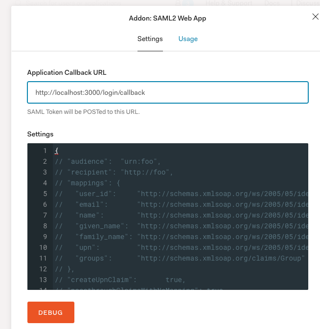
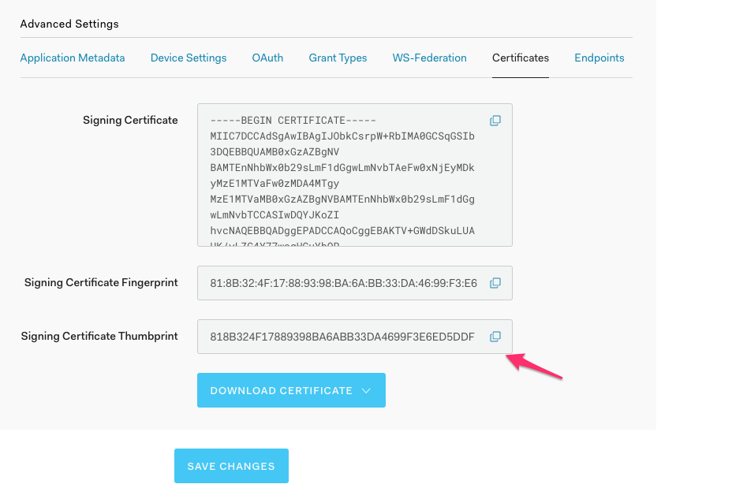

# SAML SP Sample

## Auth0 Setup

- Create a regular web application in Auth0 and enable Database connection on it.
- Enable SAML Addon from "Addons Tab" and enter `https://localhost:3000/login/callback` as Callback URL as shown below.

- Rename `.env.sample` to `.env` add `AUTH0_DOMAIN`, `CLIENT_ID` and `SIGNING_CERT_THUMBPRINT`. The thumbprint is available from `Settings -> Advanced Settings`.

## How to run locally

**Required Node Version: 8.17.0**

- `git clone git@github.com:zamd/wsfedidp-samlsp-sample.git`
- `cd wsfedidp-samlsp-sample && git checkout master`
- `nvm use lts/carbon`
- `npm install`
